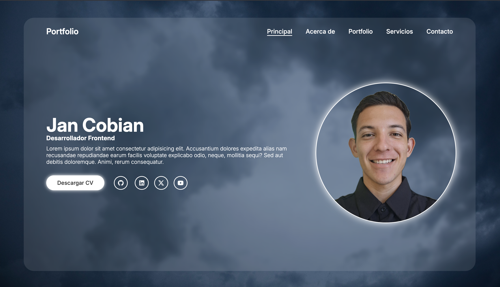

# Mi portfolio personal

¡Hola! 👋 Bienvenido al repositorio de mi portafolio personal. Este es un proyecto creado para demostrar mis habilidades como **Desarrollador**,

## 🚀 Demo en Vivo

Puedes ver el sitio en acción desplegado en GitHub Pages:

**[https://Cobian04.github.io/Portfolio/](https://Cobian04.github.io/Portfolio/)**

## 📸 Vista Previa

## 🛠️ Tecnologías Utilizadas

Este proyecto fue construido usando las tecnologías web fundamentales:

* **HTML5:** Para la estructura semántica.
* **CSS3:** Para todos los estilos, incluyendo:
* **Git y GitHub:** Para el control de versiones y despliegue.
* **Remixicon:** Para la biblioteca de iconos.

---

## ✨ Características

* **Diseño Moderno:** Una interfaz limpia y profesional con un efecto "glassmorphism" (fondo borroso).
* **Desplegado con GitHub Pages:** Alojado y desplegado de forma gratuita y automática desde la rama `main`.

---

## 💬 Contáctame

¡Conectemos!

* **LinkedIn:** [Jan Cobian](https://www.linkedin.com/in/jan-cobian-954431248/)
* **GitHub:** [Cobian04](https://github.com/Cobian04)